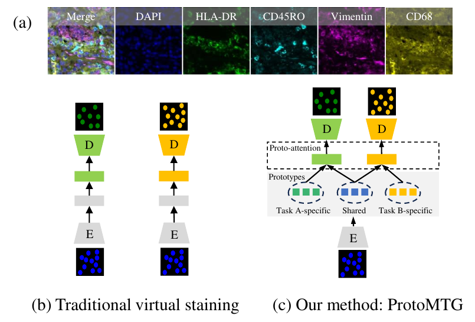

# <div align="center"> ProtoMTG: Prototypical Multi-Task Learning for the Generation of Multiple Stained Immunohistochemical Images </div>


---


<div align=center>
	
	<p align=left style="color: #777">Multiplex immunohistochemistry (mIHC) images have potential to asses the complex tumor microenvironment by simultaneously detecting multiple markers within a single tissue section, however, the acquisition of mIHC images in clinical labs are both time-consuming and costly. Hence, applying machine learning-based virtual staining techniques for rapid generation of different mIHC markers has become a considerable alternative. The existing bio-image based virtual staining models generate the distribution of different markers independently, which has limited explainable ability and overlooks the fact that the exploration of potential interrelationships among these markers can help determine the localization of each individual marker. To address the above issues, we propose an explainable prototypical multi-task generation framework (i.e., ProtoMTG) to simultaneously generate multiple mIHC markers.</p>
</div>

---

---

## Get Started
The project dependencies can be installed:

```bash
conda create -n protomtg
pip install -r requirements.txt
conda activate protomtg
```

# Run experiments


* `main.py` is used to run models including ProtoMTG. An example of usage is
```bash
conda activate protomtg
python ./main.py
```

* `test.py` is used for inference only using pre-trained models. An example of usage is

```bash
conda activate protomtg
python ./test.py
```

* `setting.py` is the config file consisting of relevant parameters. You can modify it by yourself.

To assist researchers unfamiliar with multi-task learning in understanding the parameters better, we provide the following explanations:

- task_kwargs: This dictionary from the configuration file records the parameters for multi-task learning.
    - task_names: Corresponding names of the tasks.
    - task_type: Corresponding types of the tasks.
    - loss_weights: Loss weights assigned to each task.

- prototype_kwargs: The dictionary for configuring prototype-related parameters.
    - num_per_task: The number of task-specific prototypes.
    - num_shared: The number of shared prototypes.
    - shape: The size of the prototypes.

- coefs: The dictionary for configuring relevant hyperparameters in the paper.
    - act: the weight of activation loss
    - div: the weight of diversity loss
